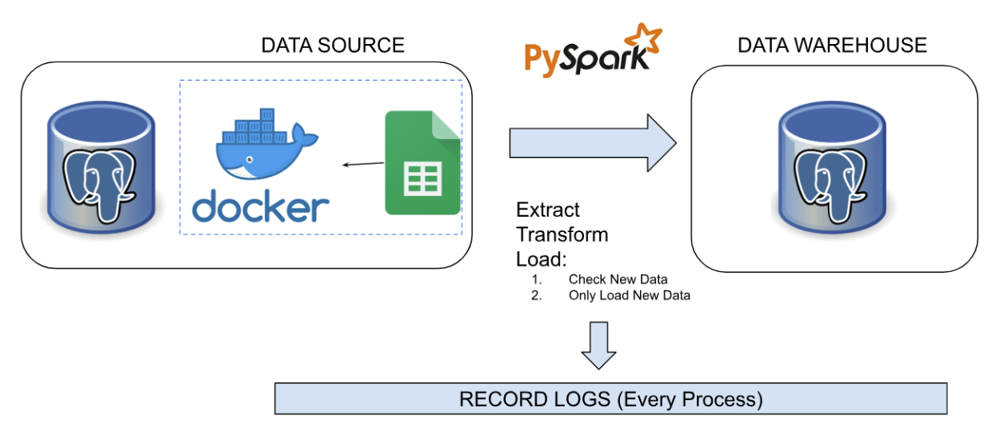

# README
## Project Overview 

In this project I will learn about building data pipeline using pyspark to integrate data from multiple sources. PySpark is the Python API for Apache Spark. It enables you to perform real-time, large-scale data processing in a distributed environment using Python. It also provides a PySpark shell for interactively analyzing your data [1]. PySpark allows users to scale Spark jobs across a cluster of machines, making it possible to handle large-scale data processing tasks efficiently. This is particularly useful for data scientists and data engineers who need to work with large volumes of data on a regular basis [2].

### Objective of the project

As information provided above, the data saved in multiple sources. One of the data (csv file) is also considered as big data with over that 800,000 data records. Processing the data with massive size can strain computational resources. Data Scientist/Data Analyst might need these data to be organized in one single storage that’s immediately suitable for analysis. So, Building Data Pipeline to Extract, Transfrom and Load it to one single Data Warehouse would be appropriate solution for it. Since the data we are dealing is large, We would use Pyspark also to process the data.
## Prerequisites

## Data Pipeline Design



1. Extract the data from Pgdatabase and csv file using pyspark. The pyspark run in Docker container.
2. Transform Data: Clean and process the data, ensuring consistency with the warehouse schema. Manipulate data before dump into Data Warehouse.
3. Load the Data Extracted. Compared it to current data in data warehouse so only new data is loaded by append method.


## Medium Page (https://istywhyerlina.medium.com/data-integration-with-pyspark-654b184aaeab)


## Setup Instructions

1. Clone the repository to your local machine.
2. Navigate to the project directory.

## Running the Project

To build and run the project, execute the following commands in your terminal:

```bash
docker compose build --no-cache
docker compose up -d
```

After the containers are up and running, if the library and dependency is not instlled. you can install manual:

```bash
docker exec -it pyspark_container pip install sqlalchemy psycopg2-binary
```

To access Jupyter Notebook on the PySpark container, check the container logs to get the token:

```bash
docker logs pyspark_container
```

example
```bash
http://127.0.0.1:8888/lab?token=3fa3b1cf2c67643874054971f23ee59bdee283b373794847
```

## Dataset
1. **Source Database (`source_db` container)**  
   - A PostgreSQL database that contains structured data related to banking transactions.
   - Tables include `customers`, `transactions`, `marketing_campaign_deposit`, and others.

2. **CSV File (`/script/data/new_bank_transaction.csv`)**  
   - A large dataset containing transactional records.
   - Requires transformation before loading into the Data Warehouse.

## Data Pipeline
The scripts for the data pipeline are located in the `/script` folder. 

## Logging
All logs generated during the execution of the data pipeline are saved in the following file:

```plaintext
/script/log/log.info
```

